# DataGrip Column Sorter

A lightweight DataGrip plugin that adds convenient column reordering actions directly to the query Result Grid toolbar.

Compatible with IntelliJ IDEA, CLion, DataGrip, DataSpell, GoLand, PhpStorm, PyCharm Pro, Rider, RubyMine, RustRover, WebStorm.

## Features

- Sort result columns alphabetically (A-Z)
- Optional mode: sort columns by data type first, then A-Z within each data type group
- Restore the original column order
- Keep pinned columns grouped first
- Works with multiple queries executed from the same console
- Native toolbar integration inside DataGrip
- Supports multiple DataGrip result views:
    - regular Result Grid
    - in-editor results
    - table view opened in a separate tab
- Adds actions to the column header context menu in the regular non-transposed table view
- Supports sorting in transposed result views
- Reorders transposed field rows together with their corresponding data
- Supports IDE actions, so commands can be triggered from the toolbar and via Find Action
- Provides plugin settings for controlling sorting behavior
- Lightweight behavior with no SQL rewriting

## Why

When working with wide query results, it is often useful to quickly reorder columns for scanning and comparison without changing the SQL query itself.

This plugin makes that possible in one click.

## How it works

The plugin changes only the visual order of columns in the Result Grid.

It does **not**:
- modify SQL text
- alter database schema
- change stored table structure
- affect query execution

## Usage

1. Run a query.
2. Open the tabular Result Grid.
3. Use the toolbar actions:
    - **Sort Columns A-Z**
    - **Restore Original Order**
4. Optionally invoke the same commands through **Find Action**.
5. Adjust plugin behavior in **Settings** if needed.

## Use Cases

### Regular result grid in Services

Use this mode when query results are opened in the standard **Services** tool window.

Typical workflow:

1. Run a query and open the regular tabular result.
2. Click **Sort Columns A-Z** in the result toolbar to reorder visible columns alphabetically.
3. If pinned columns are configured in plugin settings, they remain grouped first.
4. Click **Restore Original Column Order** to return the current result set to its initial visual order.

This is useful for:
- scanning wide result sets faster
- comparing similarly named columns
- temporarily reordering columns without changing SQL

### In-editor Results view

Use this mode when query results are displayed directly under the SQL editor.

Typical workflow:

1. Execute a query with **In-Editor Results** enabled.
2. Use **Sort Columns A-Z** from the in-editor result toolbar.
3. Review the reordered columns without leaving the editor.
4. Use **Restore Original Column Order** to restore the initial order for that result set.

This is useful for:
- fast ad-hoc analysis inside the editor
- keeping the query text and results visible in one place
- quick temporary reordering during iterative query work

### Table view opened in a separate tab

Use this mode when a table or result set is opened in its own dedicated tab.

Typical workflow:

1. Open a table or a result set in a separate tab.
2. Use **Sort Columns A-Z** from the toolbar of that view.
3. Reorder the visible columns for easier inspection.
4. Use **Restore Original Column Order** to return to the original layout.

This is useful for:
- working with large tables in a focused view
- exploring schema-heavy tables with many columns
- restoring the original layout after temporary sorting

### Column header context menu in regular table view

In the regular non-transposed table view, the plugin also adds actions to the **column header context menu**.

Typical workflow:

1. Right-click a column header in a regular result grid.
2. Choose **Sort Columns A-Z** to reorder visible columns alphabetically.
3. Choose **Restore Original Column Order** to restore the original layout.

This is useful for:
- mouse-driven workflows
- quick access directly from the grid header
- sorting without moving focus to the toolbar

### Transposed table view

The plugin also supports **transposed** result grids.

In a transposed view:
- field names are displayed as rows on the left
- each result row becomes a numbered column at the top

Typical workflow:

1. Open a query result in tabular form.
2. Enable **Transpose** in DataGrip.
3. Click **Sort Columns A-Z**.
4. The field rows in the transposed grid are reordered alphabetically.
5. The corresponding data rows move together with the field names.
6. Use **Restore Original Column Order** to return to the original field order.

This is useful for:
- inspecting wide tables in vertical form
- reading long column lists more comfortably
- grouping fields alphabetically while preserving row-to-data alignment

## Sorting by data type

The plugin can optionally sort fields by **data type first** and then **alphabetically inside each type group**.

Typical example in a PostgreSQL result:
- boolean fields can be grouped together
- integer fields can be grouped together
- numeric fields can be grouped together
- varchar and text fields can be grouped together
- timestamp fields can be grouped together
- json/jsonb fields can be grouped together
- etc.

This is useful when you work with wide tables and want related fields to stay visually grouped.

### Data Type Rules format

**Type priority order**  

A list of type rules in the format `jdbcType|typeName`.

The plugin processes the list from top to bottom, so higher rules get higher priority during type-based sorting.
You can reorder the rules in Settings to change how type groups are arranged in the result grid.

Example:
  - `-7|bool`
  - `4|int4`
  - `12|varchar`
  - `2|numeric`
  - `93|timestamp`

  The plugin uses this order when **Sort by data type first** is enabled.

### How to enable it

1. Open **Settings | Column Sorter**.
2. Enable the option for **sorting by data type first**.
3. Adjust the **type priority order** in settings.
4. Run a query and click **Sort Columns A-Z**.

When the option is enabled, the same sort action works like this:

1. Pinned columns are placed first, if that option is enabled
2. The remaining fields are grouped by type according to the configured priority
3. Fields inside the same type group are sorted alphabetically

## Screenshots

#### Before sorting columns

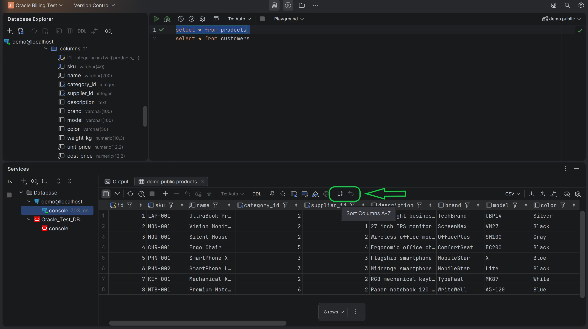

#### After sorting columns

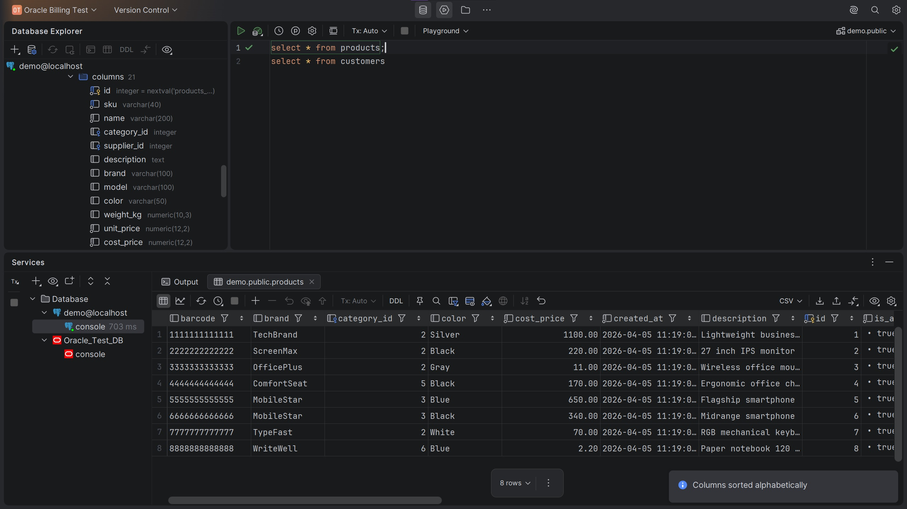

#### Pinned column (when the option is enabled in Settings, the "id" column is pinned)

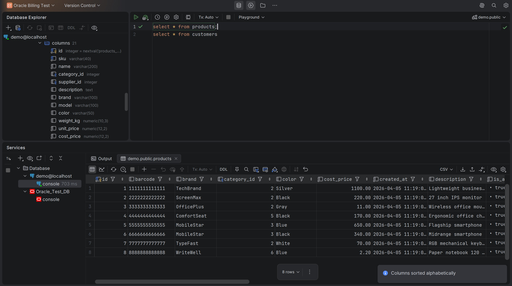

#### Before restoring the columns order

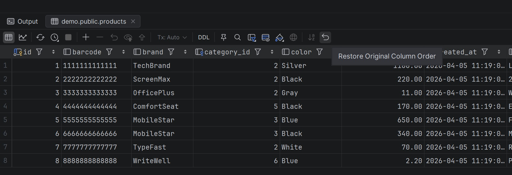

#### After restoring the columns order

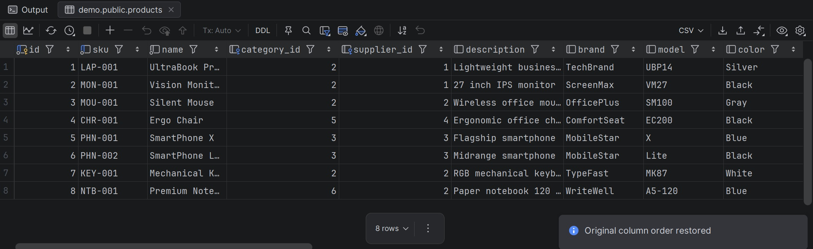

### New Features

#### In-editor results view

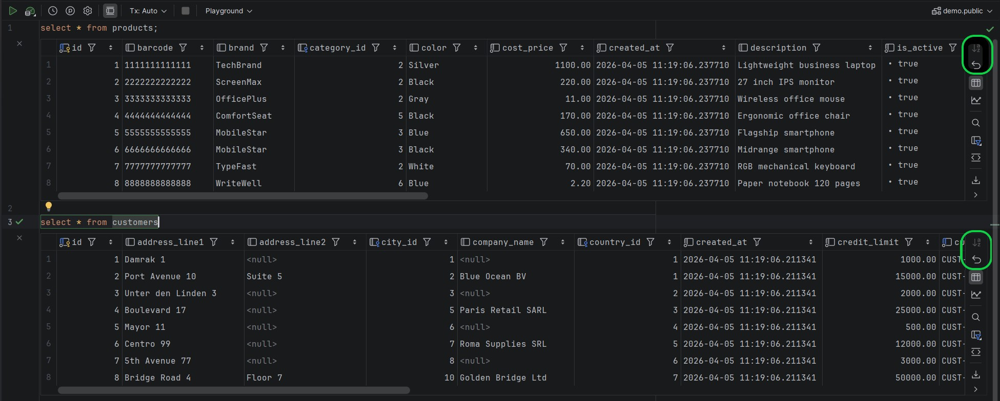

#### Separate Table view

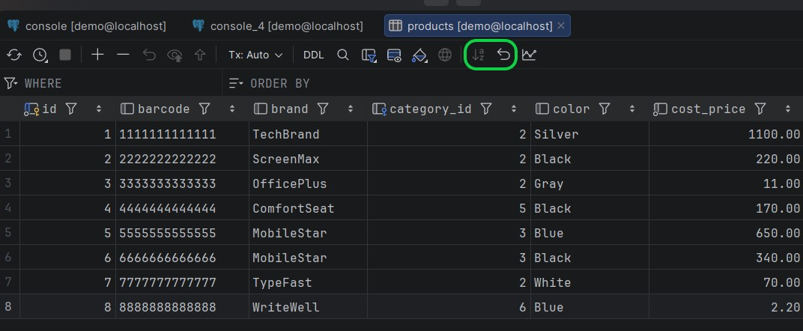

#### Column header context menu in regular table view

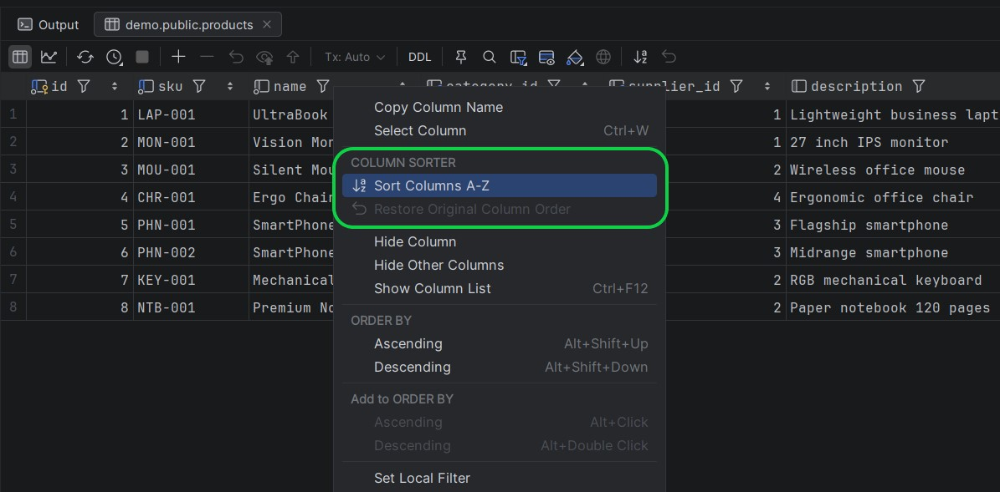

#### Transposed result view

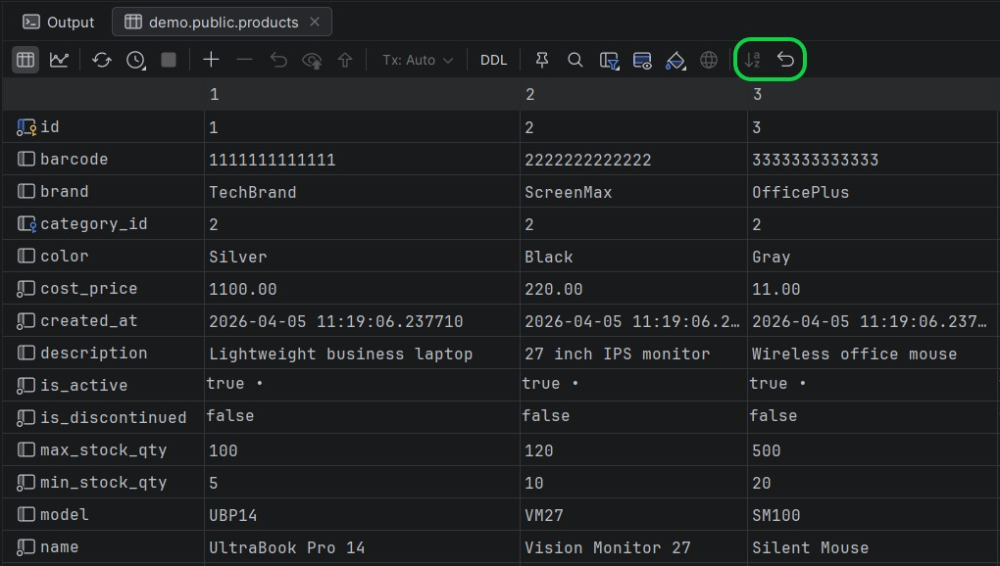

### Sorting by data type Settings

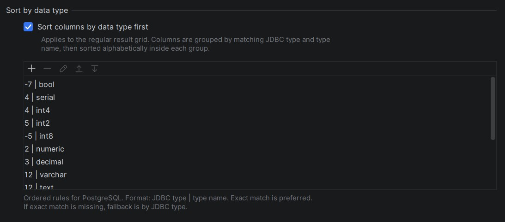

### Sorting by data type - Regular result view

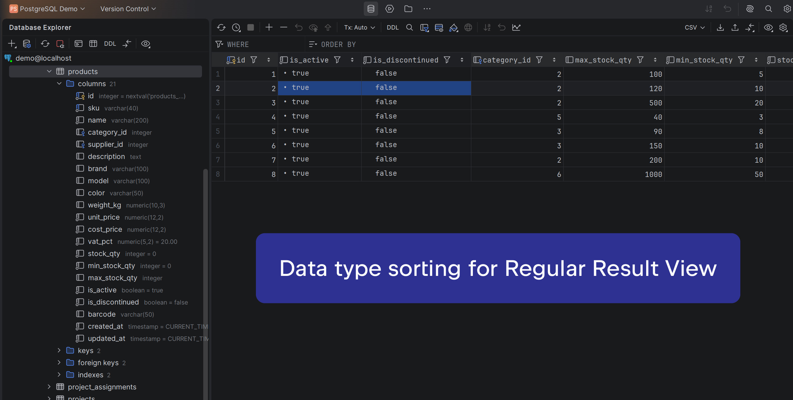

### Sorting by data type - Transposed result view

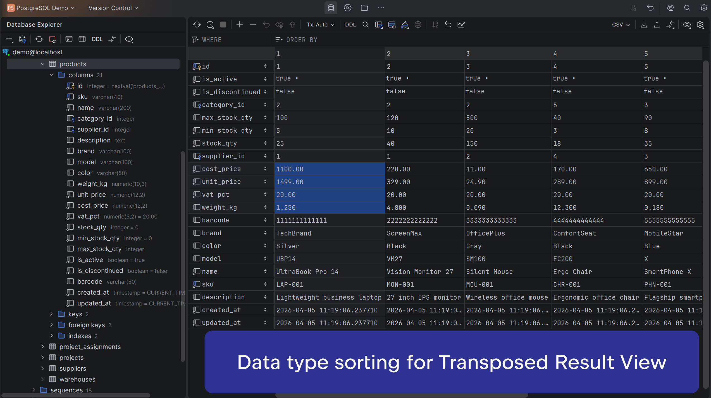

## Actions

The plugin provides the following actions in the query Result Grid toolbar:

- **Sort Columns A-Z** — sorts visible columns alphabetically
- **Restore Original Order** — restores the original column order for the current result set

These actions are also available through **Find Action** in DataGrip, so they can be invoked without clicking the toolbar manually.

This makes the plugin convenient both for mouse-driven usage and for keyboard-oriented workflows.

## Settings

The plugin provides configurable settings for column sorting behavior.

To open plugin settings in DataGrip:

1. Open **File | Settings** on Windows/Linux, or **DataGrip | Settings** on macOS
2. Navigate to the plugin settings page **"Column Sorter"**
3. Adjust the available column sorting options

Available settings:

- **Show 'Sort Columns A-Z' button**  
  Shows or hides the toolbar button for alphabetical sorting of columns in the Result Grid.

- **Show 'Restore Original Column Order' button**  
  Shows or hides the toolbar button for restoring the original column order of the current result set.

- **Pinned columns**  
  A case-insensitive list of column names that should be treated as pinned.  
  Add one column name per item.

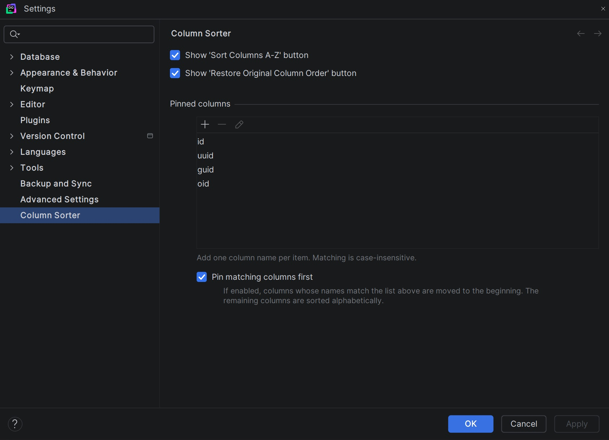

## Current functionality

- Alphabetical sorting of visible result columns
- Restore to the original order for the current result set
- Pinned columns remain grouped first
- Correct handling of multiple result sets executed from the same console
- Integrated action buttons with native JetBrains icons
- Support for IDE actions through the DataGrip action system

## Compatibility

Built for DataGrip on the IntelliJ Platform.

This plugin is currently developed and tested with:

- **DataGrip 2026.1.1** (build **261.22158.354**)
- **JDK 21**
- **Kotlin 2.3.20**
- **IntelliJ Platform Gradle Plugin 2.13.1**

Plugin target:
- **since-build: 261**

Compatible with other supported IntelliJ Platform IDEs (since 2026.1.1), including:

- **IntelliJ IDEA**
- **CLion**
- **DataGrip**
- **DataSpell**
- **GoLand**
- **PhpStorm**
- **PyCharm Pro**
- **Rider**
- **RubyMine**
- **RustRover**
- **WebStorm**

## Author

**Alexander Khudoev**  
Website: https://khudoev.dev  
GitHub: https://github.com/identificator

## Source Availability

The source code is published for transparency and reference purposes only.
This repository does not grant permission to copy, modify, redistribute, or commercialize the plugin.

## License

Copyright (c) 2026 Alexander Khudoev. All rights reserved.

This project is source-available, but it is not open source.

You may use the plugin in its original, unmodified form, but you may not copy, modify, redistribute, sublicense, resell, or create derivative works from the plugin or its source code without prior written permission.